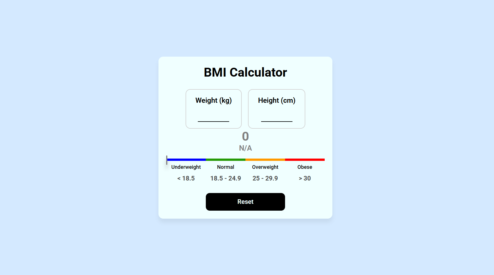

# BMI Calculator

This is a simple Body Mass Index (BMI) calculator built with React. It allows users to input their weight and height to calculate their BMI and determine their weight category.

## Features

- Input weight and height to calculate BMI.
- Displays BMI score and corresponding weight category.
- Color-coded results for easy interpretation.
- Reset button to clear inputs and results.

## Setup and Installation

### Prerequisites

To run this project, you need to have the following installed:

- Node.js
- npm (Node Package Manager)

### Steps

1. **Clone the repository**:

   ```bash
   git clone https://github.com/your-username/bmi-calculator.git
   cd bmi-calculator
   ```

2. **Install dependencies**:

   ```bash
   npm install
   ```

3. **Run the development server**:

   ```bash
   npm start
   ```

4. Open the application in your browser by navigating to `http://localhost:3000`.

## Technologies Used

- React.js
- JavaScript
- CSS (for styling)

## Screenshots



## License

This project is licensed under the MIT License.
Copyright (c) [2025] [Samvel Toroyan]

---

# Калькулятор BMI

Это простой калькулятор индекса массы тела (BMI), созданный с использованием React. Позволяет пользователям вводить свой вес и рост для вычисления BMI и определения категории веса.

## Особенности

- Ввод веса и роста для расчета BMI.
- Отображение результата BMI и соответствующей весовой категории.
- Цветовое кодирование результатов для наглядности.
- Кнопка сброса для очистки данных.

## Установка и настройка

### Требования

Для запуска этого проекта необходимо установить:

- Node.js
- npm (менеджер пакетов для Node.js)

### Шаги

1. **Клонировать репозиторий**:

   ```bash
   git clone https://github.com/your-username/bmi-calculator.git
   cd bmi-calculator
   ```

2. **Установить зависимости**:

   ```bash
   npm install
   ```

3. **Запустить сервер для разработки**:

   ```bash
   npm start
   ```

4. Открыть приложение в браузере, перейдя по адресу `http://localhost:3000`.

## Используемые технологии

- React.js
- JavaScript
- CSS (для стилей)

## Лицензия

Этот проект лицензирован под лицензией MIT.
Copyright (c) [2025] [Samvel Toroyan]
